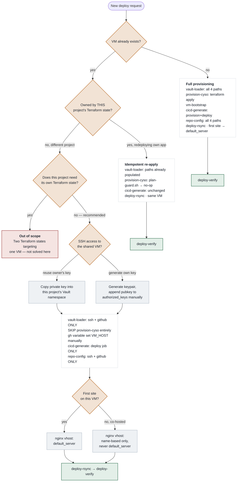

# Deploy Target Resolution — Decision Flow (diagram)

Companion diagram for [`084_deploy_target_resolution_provisioning_branch.md`](084_deploy_target_resolution_provisioning_branch.md).
An interactive rendered version also exists at
https://claude.ai/code/artifact/a035b9bd-b1e4-4750-a2c7-4a9326b4f235 — this file is the durable,
in-repo source of truth; the link is a nicer-to-read copy, not a dependency.

## Legend

- **Diamond** — decision point
- **White box** — sequence of skill invocations for that path
- **Grey box** — sub-branch / mechanism choice
- **Green box** — terminal, verified working
- **Red box** — explicitly out of scope for this task

## The five decisions, in order

1. **Does the target VM already exist?** The only question the current flow asks correctly — but
   implicitly, by whether `smaqit.infrastructure-provision-cyso` happens to be invoked, not as an
   explicit gate anything else can read.
2. **Owned by this project's own Terraform state?** Redeploying to your own VM and deploying onto a
   *different* project's VM both look like "VM exists" from the outside but need entirely different
   handling. The "yes" path (idempotent re-apply via `plan-guard.sh`'s no-op) already works today;
   the "no" path is the entire unhandled case.
3. **Does the deploying project need its own Terraform state?** Two Terraform states with opinions
   about the same VM is a coordination problem this task doesn't try to solve — recommended answer
   is always no for a co-hosted app; "yes" is flagged out of scope.
4. **How does this project get SSH access to a VM it doesn't own?** `vault-loader`'s SSH step
   auto-generates a fresh keypair whenever one is missing — correct default for a new VM, silently
   wrong here, since a brand-new key was never added to the shared VM's `authorized_keys`. Two valid
   mechanisms, not one automated default: reuse the owning project's key material, or generate a new
   one and manually authorize it once.
5. **Is this the first site on the VM, or a co-host?** The one decision already designed for
   correctly elsewhere (nginx `default_server` vs. name-based vhost) — included here because it's
   the payoff of getting decisions 1–4 right.
