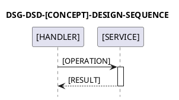

```plantuml
@startuml
title DSG-DSD-[CONCEPT]-DESIGN-SEQUENCE
participant "[HANDLER]" as Handler
participant "[SERVICE]" as Service
hide footbox
Handler -> Service: [OPERATION]
' impl: [RELATIVE/PATH/TO/FILE.EXT]:[LINE]
activate Service
Service --> Handler: [RESULT]
deactivate Service
@enduml
```
