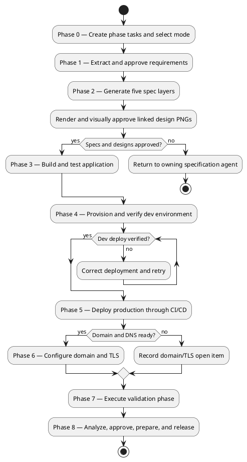
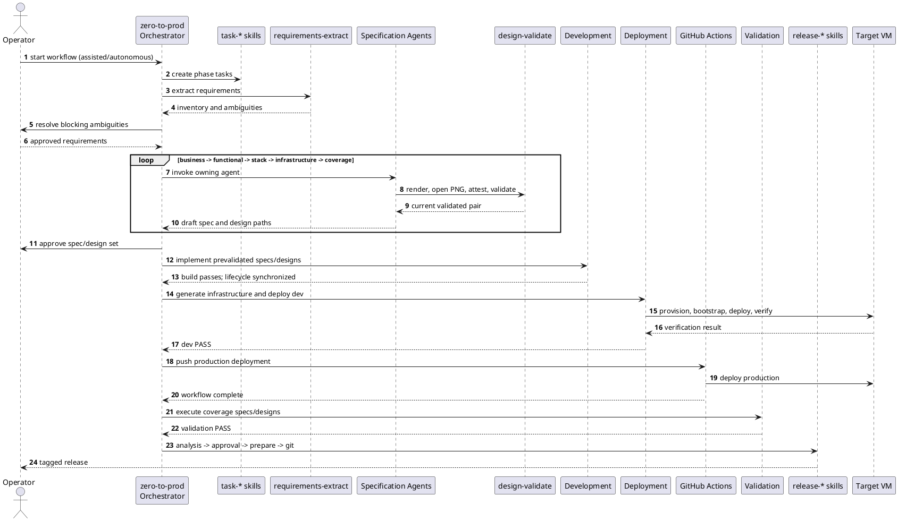
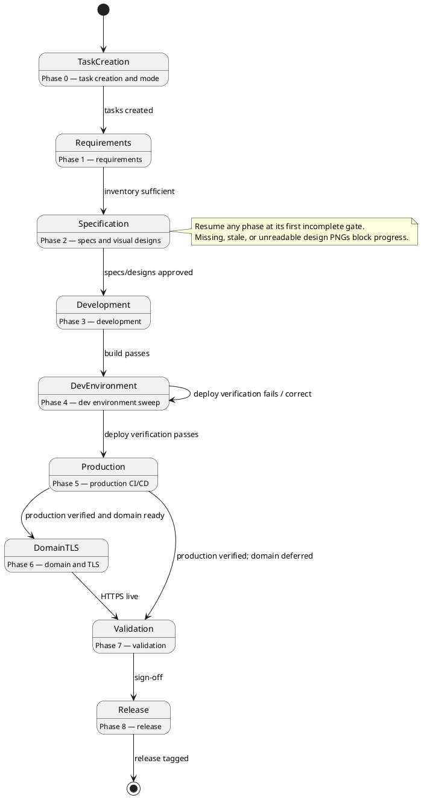
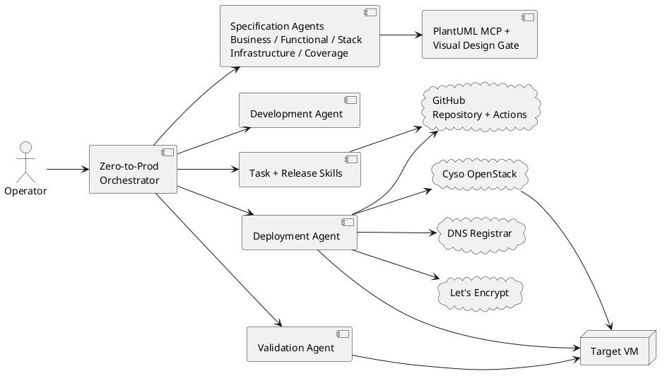
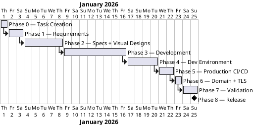

# Zero-to-Prod Workflow — Diagrams

Five complementary PlantUML views of the `smaqit.new-greenfield-project` orchestrator workflow.

## 1. Activity — End-to-End Journey

## 2. Sequence — Invocation Order

## 3. State — Gates and Re-entry

## 4. Component — Responsibility Boundaries

## 5. Gantt — Relative Phase Sequencing

Durations are illustrative.

## Selection Guide

| View | Best for |
|---|---|
| Activity | Onboarding and gate/branch explanation |
| Sequence | Invocation ownership and ordering |
| State | Re-entry and failure-loop behavior |
| Component | External-system reach and security review |
| Gantt | Relative duration and dependency planning |
