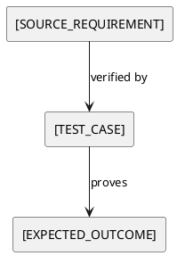

```plantuml
@startuml
rectangle "[SOURCE_REQUIREMENT]" as Requirement
rectangle "[TEST_CASE]" as TestCase
rectangle "[EXPECTED_OUTCOME]" as Outcome
Requirement --> TestCase : verified by
TestCase --> Outcome : proves
@enduml
```
