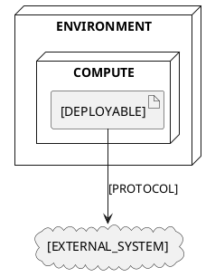

```plantuml
@startuml
node "[ENVIRONMENT]" {
  node "[COMPUTE]" {
    artifact "[DEPLOYABLE]" as Deployable
  }
}
cloud "[EXTERNAL_SYSTEM]" as External
Deployable --> External : [PROTOCOL]
@enduml
```
